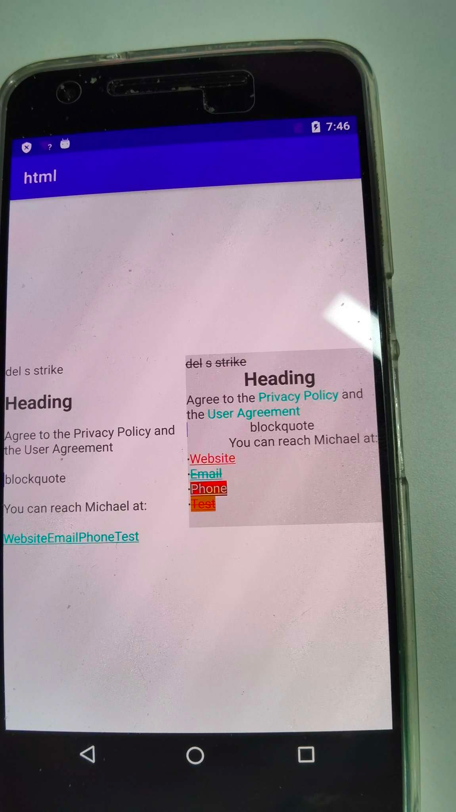

# html

兼容(HTML to Spanned) 7.0(API 24) 新增的一些标签和样式，可以通过自定义 ElementHandler 方便地实现自定义标签。

内置了 CustomElementHandler，支持action标签，也可以作为参考实现自己的 ElementHandler

```xml
<action name="...">...</action>
```



## Gradle

``` groovy
repositories {
    maven { url "https://gitee.com/ezy/repo/raw/cosmo/"}
}
dependencies {
    implementation "me.reezy.cosmo:html:0.7.0"
}
```

## HTML to Spanned


 5.0(API 21)

|tags|Spanned|
|---|---|
|`<br>` |"\n"
|`<div>` |"\n\n"
|`<h1> <h2> <h3> <h4> <h5> <h6>` |"\n\n" RelativeSizeSpan(1.5f~1.0f) StyleSpan(Typeface.BOLD)
|`<blockquote>` | QuoteSpan()
|`<a href="...">` |URLSpan()
|`<strong> <b>` |StyleSpan(Typeface.BOLD)
|`<em> <cite> <dfn> <i>`| StyleSpan(Typeface.ITALIC)
|`<big>` |RelativeSizeSpan(1.25f)
|`<small>` |RelativeSizeSpan(0.8f)
|`<font color="..." face="...">` |ForegroundColorSpan() TypefaceSpan()
|`` |ImageSpan()
|`<sub>` |SubscriptSpan()
|`<sup>`| SuperscriptSpan()
|`<tt>` |TypefaceSpan("monospace")
|`<u>` |UnderlineSpan()

从7.0(API 24)开始
- 新增 `ul li span del s strike` 标签支持
- `p div ul li blockquote h1 h2 h3 h4 h5 h6` 等块级元素支持样式(style)
  - 文本对齐 `text-align:start|center|end;`
- `p span li` 等元素支持样式
  - 前景色 `color: #------;`
  - 背景色 `background-color: #------;` `background: #------;`
  - 删除线 `text-decoration:line-through;`

|tags|Spanned|
|---|---|
|`<del> <s> <strike>` | Strikethrough()

## Spanned to HTML


|Spanned|tags|
|---|---|
|QuoteSpan() | `<blockquote>`
|StyleSpan(Typeface.ITALIC) | `<i>`
|StyleSpan(Typeface.BOLD) | `<b>`
|TypefaceSpan("monospace") | `<tt>`
|SuperscriptSpan() | `<sup>`
|SubscriptSpan() | `<sub>`
|UnderlineSpan() | `<u>`
|StrikethroughSpan() | `<span style="text-decoration:line-through;">`
|URLSpan("...") | `<a href="...">`
|ImageSpan("...") | ``
|SuperscriptSpan() | `<sup>`
|SuperscriptSpan() | `<sup>`
|AbsoluteSizeSpan() | `<span style="font-size:%.0fpx";>`
|RelativeSizeSpan() | `<span style="font-size:%.2fem;">`
|ForegroundColorSpan() | `<span style="color:#%06X;">`
|BackgroundColorSpan() | `<span style="background-color:#%06X;">`


支持生成的块级元素有 `<div><blockquote><ul><li><p>`


未使用选项时
- `AlignmentSpan()` 生成 `<div>`
- QuoteSpan被忽略
- 一个"\n" 换行 `<br>\n`
- 两以上个"\n"分段 `<br>...<p dir="rtl|ltr">`


使用选项`TO_HTML_PARAGRAPH_LINES_INDIVIDUAL`时，以"\n"分隔产生`<p>`和`<li>`
- 每组 `BulletSpan()` 生成一个 `<ul style="margin-top:0; margin-bottom:0;">`
  - 单个 `BulletSpan()` 生成 `<ul><li /></ul>`
  - 多个连续的 `BulletSpan()` 生成 `<ul><li /><li /><li />... </ul>`
  - `BulletSpan()` + `AlignmentSpan` 生成 `<li dir="..." style="text-align:...">`
- `AlignmentSpan()` 生成 `<p dir="rtl|ltr" style="margin-top:0; margin-bottom:0;text-align:start|center|end;">`


## LICENSE

The Component is open-sourced software licensed under the [Apache license](LICENSE).